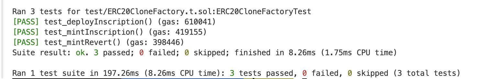

## 最小代理示例——铭文工厂
使用 openzeppelin 的 eip1167 实现

MiniERC20.sol 是模拟铭文合约，精度是固定1e18。初始化后，将所有“铭文”erc20全部分配给工厂合约。mint铭文是从工厂转移给调用者。

### 测试
test_deployInscription 测试克隆成功，铭文设置成功
test_mintInscription 代币分配正确，管理员和tokenOwner的手续费分配正确
test_mintRevert 铸造超过数量，失败

