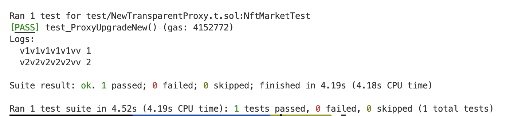
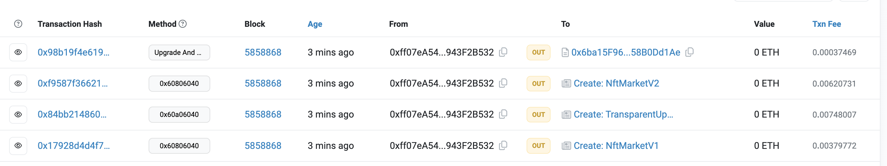
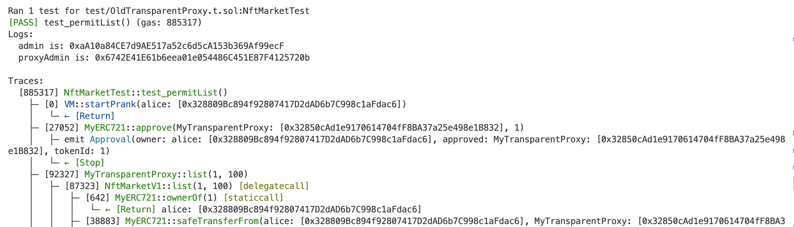

## 编写一个可升级的 NFT Market 合约

### 透明代理测试
OldTransparentProxy.t.sol //不使用 openzeppelin-upgrade工具的测试用例
NewTransparentProxy.t.sol //使用 openzeppelin-upgrade工具

//TransparentUpgradeableProxy.s.sol //部署脚本

### 部署、开源

https://sepolia.etherscan.io/address/0xff07eA54B66De1774054Ce8B5a084A7943F2B532

### erc712测试
forge test --mt permitList   
