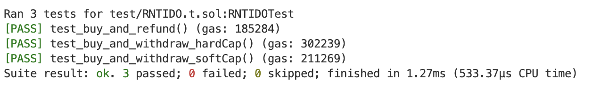
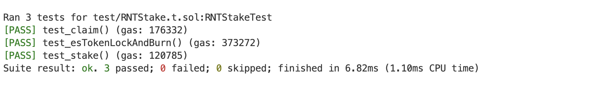

## 编写IDO募集ETH发行Token
测试用例 
test_buy_and_refund() 未达软顶，退款
test_buy_and_withdraw_softCap() 达到软顶，各方取款取币正常
test_buy_and_withdraw_hardCap() 达到硬顶，各方取款取币正常

## 编写质押挖矿合约
功能：在RNTStake里实现 
1. stake RNT代币
2. claim esRNT代币奖励
3. lock esRNT代币
4. burn esRNT代币，获得RNT

测试用例
test_claim() 测试stake后claim，数量正常
test_esTokenLockAndBurn() 测试多次lock后burn esRNT，获得rnt数量正常
test_stake()  测试stake后unstake，数量正常
