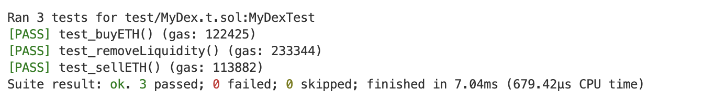

## 用Solidity从Uniswap中兑换ETH
实现了 Mydex、MyLibrary 调用 factory 和 pair 进行 swap。
添加、移除流动性的两个功能直接调用了 router，没有自己实现。

setUp 添加流动性、创建交易对
test_buyETH() 使用代币购买ETH
test_sellETH() 使用ETH购买代币
test_removeLiquidity()  移除流动性

